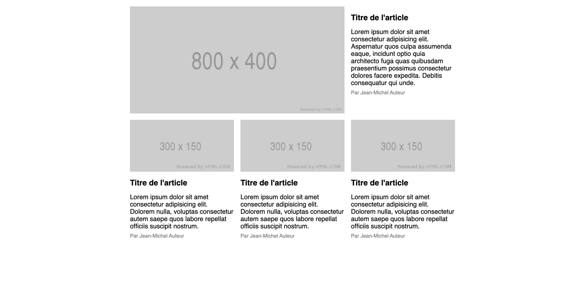
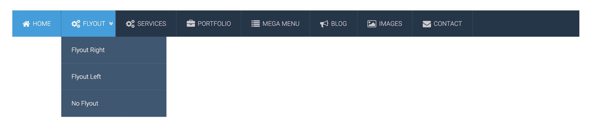
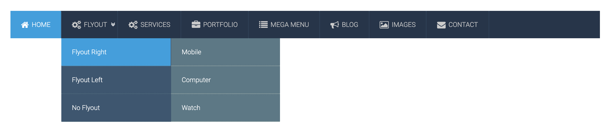

# Practice 01
- Create a layout like this image bellow


## Move to this folder bellow to see all neccessary resources:
```
/layout
```


# Practice 02
- Create a menu that fixed 3 generation as this images bellow

## State 1: fold menu (not hover to any item)


## State 2: hover to an item


## Hình 3: hover to child menu, show child menu


### Move to this folder bellow to see all neccessary resources:
```
./menu
```