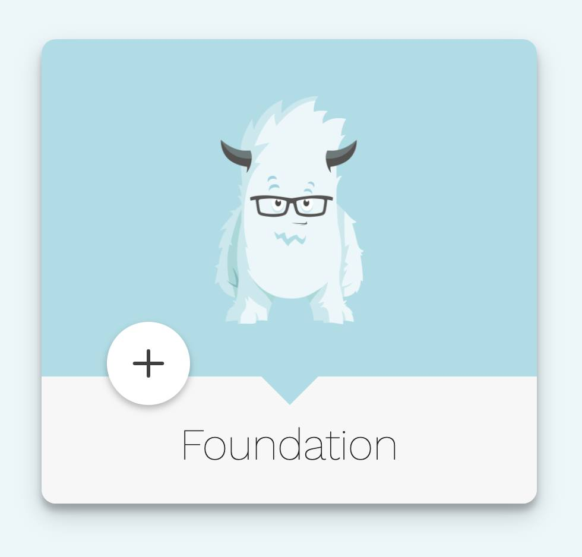
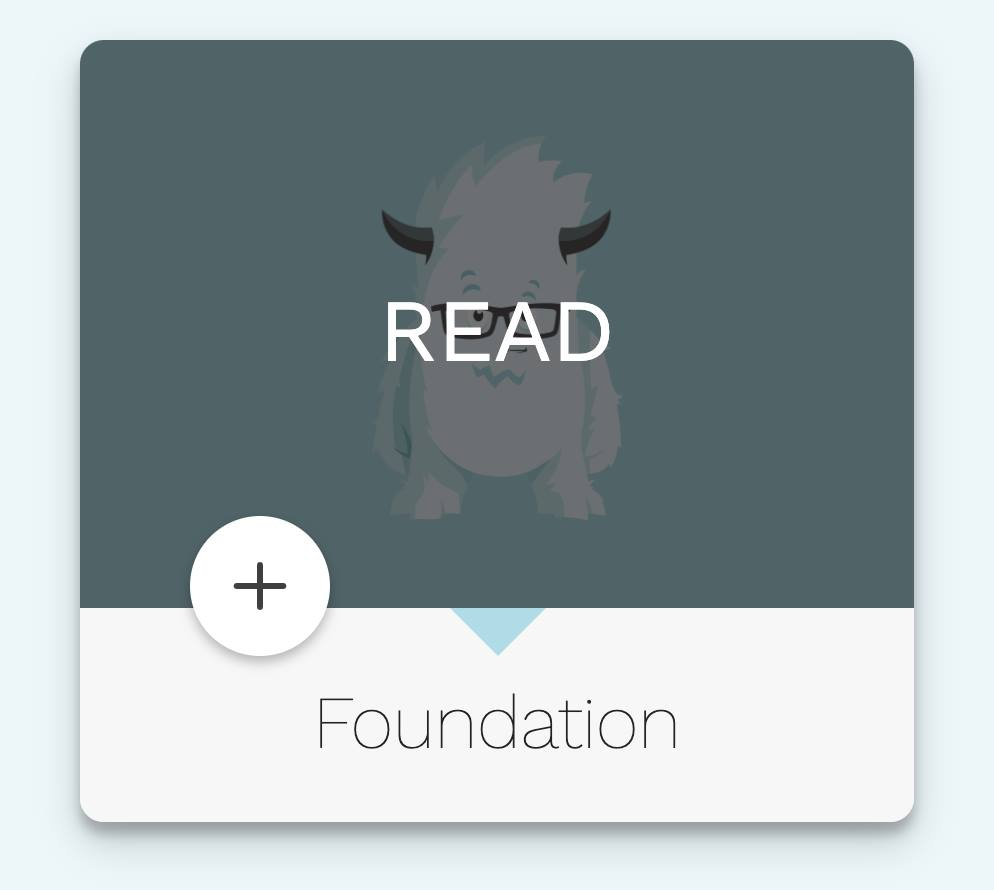
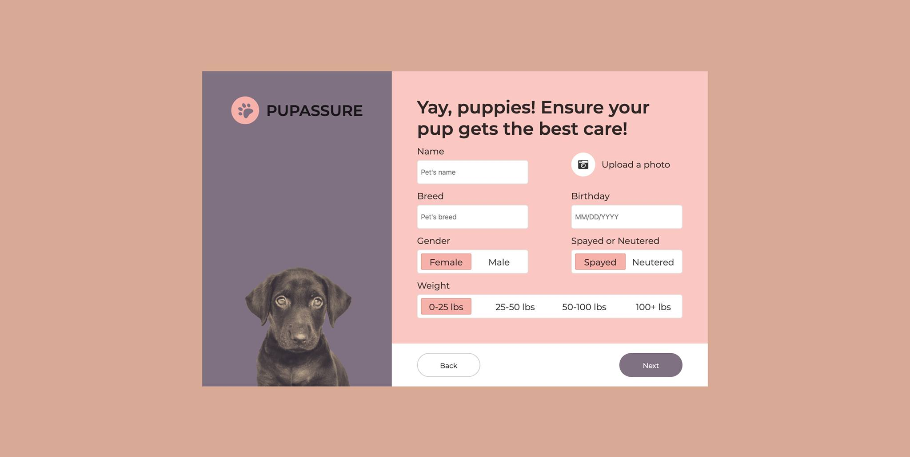

# Practice 01
- Create a card like this images bellow

## State 1: not hover to card

## State 2: hover to card

# Practice 02
- Create a form (`form-pet`) like this image bellow

## Bài 3
- Create the `memories` cards like this image bellow

### Note:
- When you hover to a card that will remove opacity in this card and rotate card straight by vertical
