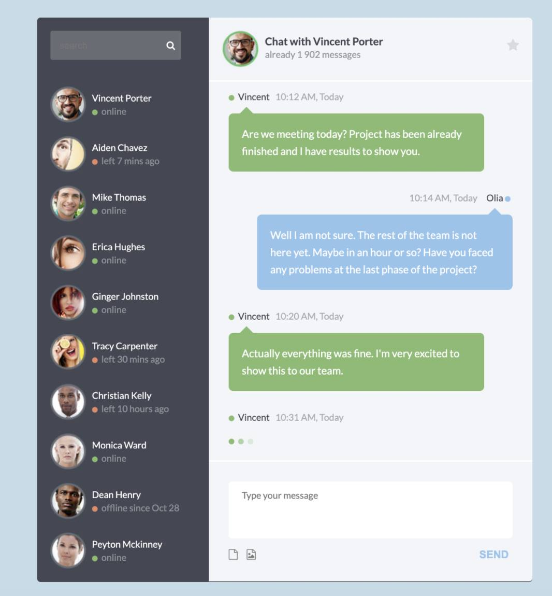
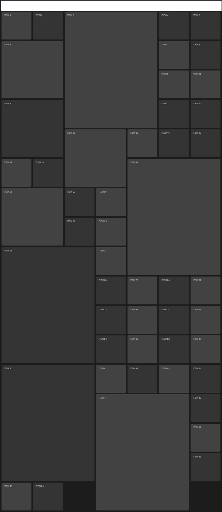

# Practice 01
- Create a chat layout like this image bellow


## Move to this folder bellow to see all neccessary resources:
```
/chat
```

# Practice 02
- Create a SP (single page) like all image in this folder bellow
```
/layout
```

## Note
- Using bootstrap is mandatory
- Using both bootstrap 3 & bootstrap 4 for each version

# Practice 03
- Create a grid like this image bellow

