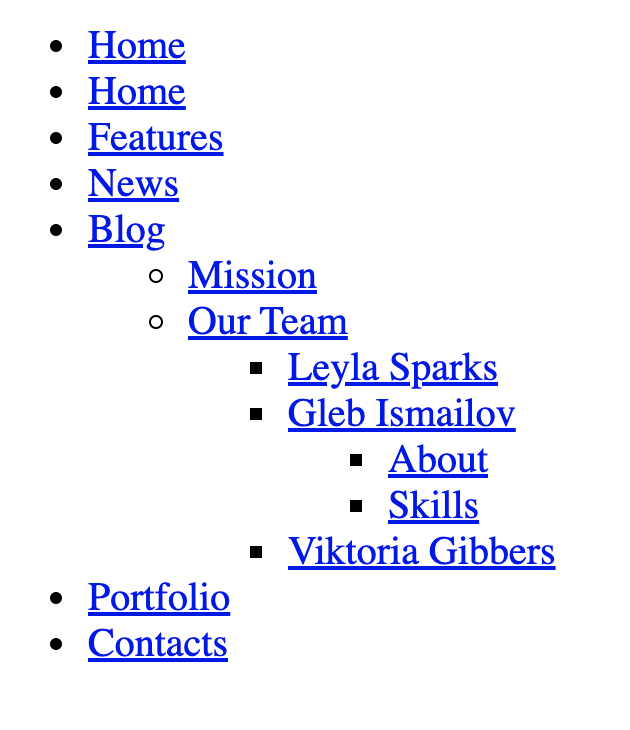
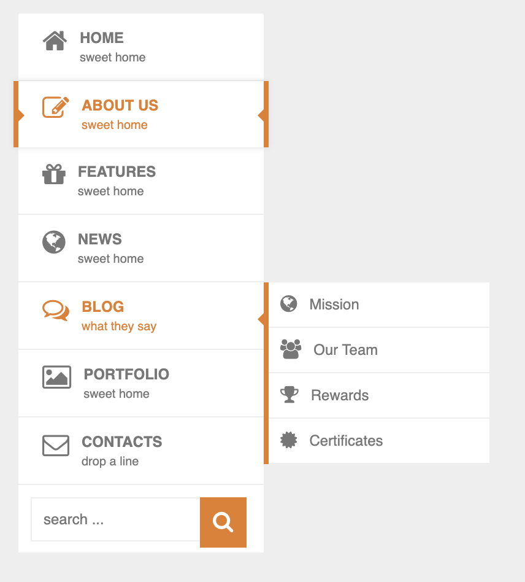
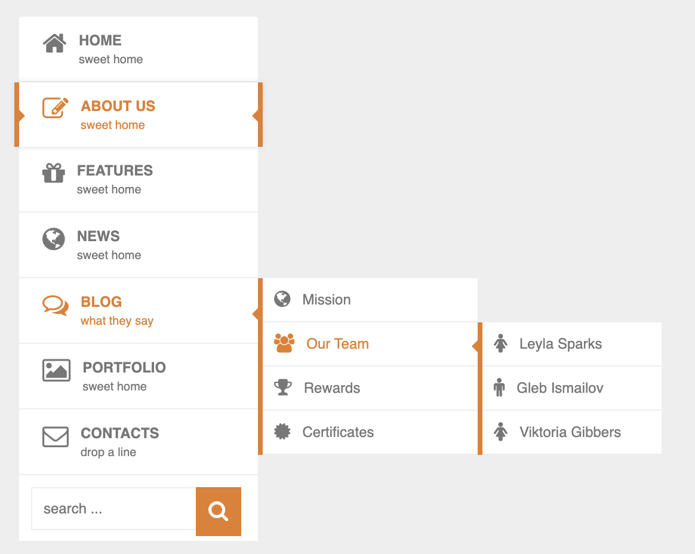

# Practice 01
- Using scss is mandatory
- Using bootstrap 3 and bootstrap 4 is mandatory
- Let's create a dynamic menu like this images bellow

## Move to this folder bellow to see all neccessary resources:
```
./deep-menu
```

## menu structure


## `fold` Mode


## hover to home


## hover to news


## hover to blog


### hover to blog, then hover to missions


### hover to blog, then hover to our team


### hover to blog, then hover to missions, then hover to our team, then hover to 1 any people


## Note
- Each item be hovered will be in orange
- Each parent menu (generation 1) that is not active state (is not current page, `isActive = true`) that will be displayed like `ABOUT US`
- Try to add animation
